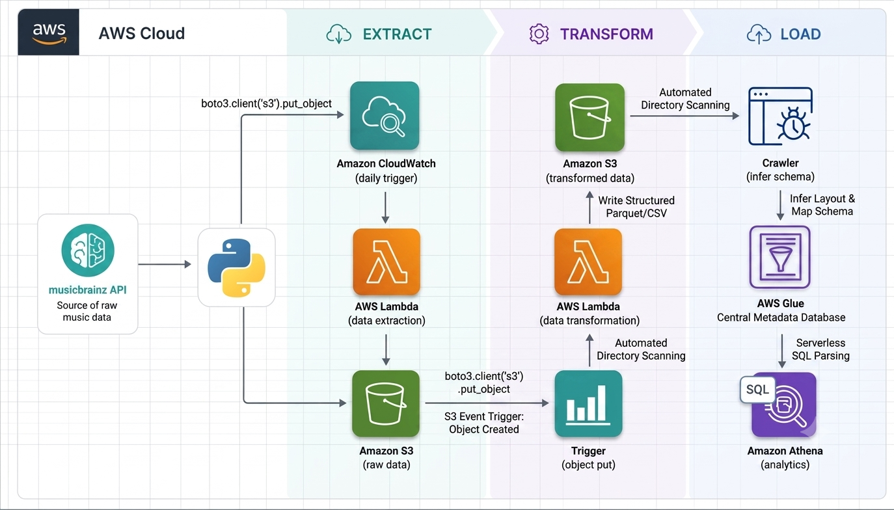

# Serverless MusicBrainz ETL Pipeline on AWS

An end-to-end **serverless ETL (Extract, Transform, Load)** pipeline built on AWS that extracts music metadata from the **MusicBrainz REST API**, transforms nested JSON into analytics-ready datasets, stores them in Amazon S3, catalogs the data with AWS Glue, and enables SQL analytics using Amazon Athena.

---

## Project Overview

This project demonstrates a modern serverless data engineering architecture using AWS managed services.

The pipeline automatically:

- Extracts music metadata from the MusicBrainz REST API
- Stores raw JSON in Amazon S3
- Transforms nested JSON into normalized datasets
- Catalogs datasets using AWS Glue
- Queries data directly from Amazon S3 using Amazon Athena

The project was originally designed around the Spotify API. During development, the data source was migrated to MusicBrainz because it provides open music metadata without OAuth or Premium account restrictions, allowing the project to focus entirely on Data Engineering concepts.

---

## Features

- Fully serverless architecture
- Automated daily data extraction
- Event-driven data transformation
- Cloud-based data lake on Amazon S3
- Automatic schema discovery with AWS Glue
- Serverless SQL analytics using Amazon Athena
- Production-style ETL workflow

---

## Business Problem

Music metadata is distributed across recordings, artists, albums, release dates, and countries in nested API responses. Although rich in information, this structure is difficult to analyze directly.

This project automates the complete ETL workflow by:

- Extracting music metadata from the MusicBrainz API
- Preserving raw API responses
- Transforming nested JSON into normalized datasets
- Storing curated datasets in Amazon S3
- Cataloging metadata with AWS Glue
- Querying the data using Amazon Athena

The resulting datasets support analytical questions such as:

- Which artists have the most recordings?
- Which countries have the most releases?
- How long are recordings on average?
- Which albums were released during specific years?

---

## Architecture

```text
                     MusicBrainz API
                            │
                            ▼
               Amazon EventBridge Scheduler
                            │
                            ▼
                 AWS Lambda (Extract)
                            │
                            ▼
                      Amazon S3
                 raw_data/to_processed/
                            │
                            ▼
                  S3 ObjectCreated Event
                            │
                            ▼
                AWS Lambda (Transform)
                            │
          ┌─────────────────┼─────────────────┐
          ▼                 ▼                 ▼
 transformed_data/   transformed_data/   transformed_data/
    song_data          artist_data         album_data
                            │
                            ▼
                  raw_data/processed/
                            │
                            ▼
                  AWS Glue Crawler
                            │
                            ▼
               AWS Glue Data Catalog
                            │
                            ▼
                   Amazon Athena
```



---

## ETL Pipeline

The pipeline is fully automated.

1. EventBridge Scheduler triggers the extraction Lambda.
2. The extraction Lambda retrieves metadata from the MusicBrainz API.
3. Raw JSON responses are stored in Amazon S3.
4. An S3 ObjectCreated event invokes the transformation Lambda.
5. The transformation Lambda converts nested JSON into normalized datasets.
6. Curated CSV datasets are written back to Amazon S3.
7. Raw JSON files are archived after successful processing.
8. AWS Glue catalogs the transformed datasets.
9. Amazon Athena provides SQL-based analytics.

---

## AWS Services

| Service | Purpose |
|----------|---------|
| Amazon EventBridge Scheduler | Automated daily pipeline execution |
| AWS Lambda | Serverless extraction and transformation |
| Amazon S3 | Raw and curated data lake |
| AWS Glue Crawler | Automatic schema discovery |
| AWS Glue Data Catalog | Metadata repository |
| Amazon Athena | Serverless SQL analytics |
| AWS IAM | Secure service permissions |

---

## Output Datasets

The transformation process produces three normalized datasets.

### Song Dataset

- Recording ID
- Recording title
- Duration (ms)
- Video flag
- First release date
- Search score
- Artist search term
- Extraction timestamp

### Artist Dataset

- Artist ID
- Artist name
- Sort name
- Artist type
- Country
- Disambiguation
- MusicBrainz URL
- Artist search term
- Extraction timestamp

### Album Dataset

- Album ID
- Album title
- Release date
- Country
- Release status
- Track count
- MusicBrainz URL

---

## Data Lake Structure

```text
musicbrainz-etl-project-luc/

raw_data/
├── to_processed/
└── processed/

transformed_data/
├── song_data/
├── artist_data/
└── album_data/

athena-results/
```

---

## SQL Analytics

After the transformed datasets are cataloged by AWS Glue, they become immediately available for SQL analysis using Amazon Athena.

Typical analyses include:

- Recording metadata exploration
- Artist discography analysis
- Album release trends
- Release country distribution
- Recording duration statistics

---

## Repository Structure

```text
musicbrainz-pipeline/

├── lambda/
│   ├── extract/
│   └── transform/
│
├── notebooks/
│
├── images/
│
├── data/
│   └── transformed/
│
├── README.md
└── .gitignore
```

---

## Technologies

- Python
- AWS Lambda
- Amazon EventBridge Scheduler
- Amazon S3
- AWS Glue
- AWS Glue Data Catalog
- Amazon Athena
- Boto3
- Pandas
- MusicBrainz REST API
- Git
- GitHub

---


## Skills Demonstrated

This project demonstrates practical experience with:

- Serverless Data Engineering
- Cloud Data Lake Architecture
- API Integration
- AWS Lambda Development
- Event-Driven Architecture
- Amazon S3
- AWS Glue
- Amazon Athena
- ETL Pipeline Development
- SQL Analytics

---


## Future Improvements

Potential enhancements include:

- Convert datasets to Apache Parquet
- Partition datasets by extraction date
- Add automated data quality validation
- Integrate Amazon QuickSight or Power BI
- Implement CI/CD using GitHub Actions
- Provision infrastructure using AWS SAM or Terraform

---


## License

This project is intended for educational and portfolio purposes.