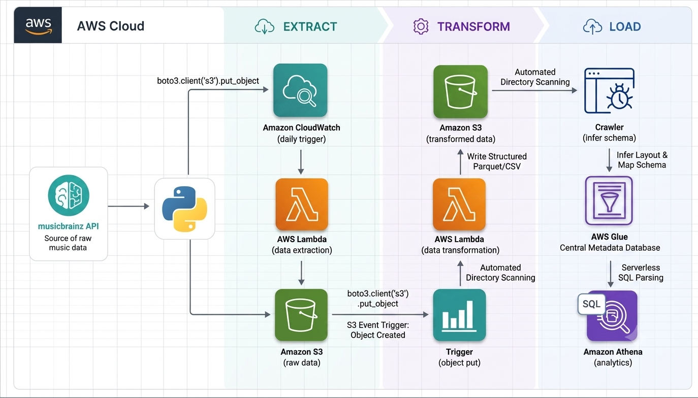

# MusicBrainz Medallion Data Lakehouse ETL Pipeline

An end-to-end batch Medallion Data Lakehouse pipeline that extracts music metadata from the MusicBrainz REST API, transforms deeply nested JSON into conformed Snappy-compressed Parquet datasets across Bronze, Silver, and Gold layers using Apache Spark (PySpark) on AWS Glue, and orchestrates the entire workflow via Apache Airflow.

---

# Introduction & Goals

Music metadata from REST APIs arrives as deeply nested JSON — recordings contain releases, which contain artists, each with their own attributes. This structure is efficient for API transport but unsuitable for high-performance analytical queries. This project implements a **production-oriented Medallion Lakehouse Architecture (Bronze $\rightarrow$ Silver $\rightarrow$ Gold)** to clean, conform, and aggregate music data into optimized columnar Parquet tables.

**Goal 1:** Ingest music metadata from the MusicBrainz REST API into an immutable Bronze data lake.  
**How I know it worked:** Multi-line raw JSON files appear in S3 (`raw_data/to_processed/musicbrainz_raw_*.json`), ~5MB per run with zero unhandled API drops.

**Goal 2:** Transform nested JSON into conformed, deduplicated dimensional and fact Parquet tables.  
**How I know it worked:** Clean Snappy Parquet files appear in S3 (`silver/{artists, albums, songs}/`) with 100% valid ANSI date formats and zero duplicates.

**Goal 3:** Compute pre-aggregated business KPIs and release trend analytics for downstream BI consumption.  
**How I know it worked:** Aggregated Parquet datasets appear in S3 (`gold/{artist_summary, yearly_release_metrics}/`), enabling sub-second analytical queries without runtime joins.

**Goal 4:** Orchestrate the end-to-end workflow with automated retries, S3 state sensors, and alert notifications.  
**How I know it worked:** Airflow DAG (`musicbrainz_etl_dag`) runs on a `@daily` schedule with dark green task status, automated exponential retries, and instant SMTP email failure alerts.

## Why This Matters

Real-world API data is messy, deeply nested, and prone to transient network drops (HTTP 503s and rate limits). Building a production-oriented data lakehouse requires decoupling raw audit ingestion from distributed compute transformations, enforcing relational integrity through Kimball dimensional modeling, and guaranteeing pipeline idempotency so historical runs never corrupt analytical tables.

---

# Architecture



```text
┌───────────────────────────────────────────────────────────────────────────────────┐
│                                 MUSICBRAINZ REST API                              │
│                             https://musicbrainz.org/ws/2                          │
└──────────────────────────────────────────┬────────────────────────────────────────┘
                                           │ HTTP GET (@retry_api_call on 503/Timeouts)
                                           ▼
┌───────────────────────────────────────────────────────────────────────────────────┐
│                                 APACHE AIRFLOW                                    │
│                            musicbrainz_etl_dag.py (@daily)                        │
│                                                                                   │
│  TaskGroup: extract_data            TaskGroup: transform_medallion                │
│  ┌──────────────────────┐          ┌──────────────────────────────────────────┐   │
│  │trigger_extract_lambda│ ───────► │check_s3_file ──► glue_bronze_to_silver   │   │
│  └──────────────────────┘          │                        │                 │   │
│                                    │                        ▼                 │   │
│                                    │               glue_silver_to_gold        │   │
│                                    └──────────────────────────────────────────┘   │
└──────────────────────────────────────────┬────────────────────────────────────────┘
                                           │
       ┌───────────────────────────────────┴───────────────────────────────────┐
       ▼                                                                       ▼
┌──────────────────────────────┐                         ┌─────────────────────────────────┐
│   AWS LAMBDA (Ingestion)     │                         │      AWS GLUE (PySpark 4.0)     │
│   musicbrainz-api-extract    │                         │   Serverless Distributed Spark  │
│                              │                         │                                 │
│  • Rate-limited API extract  │                         │  • Job 1: Bronze -> Silver      │
│  • Exponential backoff       │                         │    (Explode, Clean, Parquet)    │
│  • Saves raw JSON to S3      │                         │  • Job 2: Silver -> Gold        │
└──────────────┬───────────────┘                         │    (Artist 360 & Yearly Trends) │
               │                                         └────────────────┬────────────────┘
               ▼                                                          │
┌─────────────────────────────────────────────────────────────────────────┴────────────────┐
│                                   AMAZON S3 LAKEHOUSE                                    │
│                           bucket: musicbrainz-etl-project-luc                            │
│                                                                                          │
│   🥉 BRONZE LAYER                     🥈 SILVER LAYER                🥇 GOLD LAYER       │
│   raw_data/to_processed/             silver/                        gold/                │
│   └── musicbrainz_raw_*.json         ├── artists/ (Snappy Parquet)  ├── artist_summary/  │
│                                      ├── albums/  (Snappy Parquet)  └── yearly_release_  │
│   scripts/                           └── songs/   (Snappy Parquet)      metrics/         │
│   ├── bronze_to_silver.py                                                                │
│   └── silver_to_gold.py                                                                  │
└──────────────────────────────────────────────────────────────────────────────────────────┘
```

---

# Contents

- [The Data Set](#the-data-set)
- [Constraints](#constraints)
- [Used Tools](#used-tools)
- [Pipelines](#pipelines)
- [Data Quality & Modeling](#data-quality--modeling)
- [Results & Execution Evidence](#results--execution-evidence)
- [Quickstart & Reproducibility](#quickstart--reproducibility)
- [What Breaks (Limitations & Scope)](#what-breaks-limitations--scope)
- [Conclusion & Next Iteration](#conclusion--next-iteration)
- [Repository Structure](#repository-structure)
- [Appendix & References](#appendix--references)

---

# The Data Set

**Source:** [MusicBrainz REST XML/JSON API v2](https://musicbrainz.org/doc/Development/XML_Web_Service/Version_2)  
**Format:** Raw Multi-line JSON (Bronze) $\rightarrow$ Snappy Parquet (Silver & Gold)  
**Target Entities:** 5 global artists spanning multiple genres and release volumes.

| Artist | API Search Query |
| :--- | :--- |
| Coldplay | `artist:"Coldplay"` |
| Taylor Swift | `artist:"Taylor Swift"` |
| Dua Lipa | `artist:"Dua Lipa"` |
| James Blunt | `artist:"James Blunt"` |
| BTS | `artist:"BTS"` |

### How Much Data Is It?

> - **Input Scope:** 5 target artists $\times$ 50 recordings limit = 250 top recordings per extraction run.
> - **Nested JSON Payload:** Each recording contains nested arrays of releases, artist credits, genres, tags, and media tracks (~20KB per recording payload).
> - **Bronze Raw Size:** ~5.2 MB raw JSON per batch run.
> - **Silver Parquet Size:** ~350 KB total compressed across 3 tables (`artists`: 6 rows, `albums`: 1,323 rows, `songs`: 250 rows).
> - **Gold Parquet Size:** ~45 KB compressed across 2 tables (`artist_summary`: 6 rows, `yearly_release_metrics`: 341 rows).
> - **Annual Projected Volume:** ~1.9 GB Bronze JSON / ~140 MB Gold Parquet on daily batch schedules.

---

# Constraints

- **Budget:** Operated strictly within the AWS Free Tier allocation ($0 out-of-pocket).
- **Compute:** Serverless execution model — AWS Lambda (max 15-min timeout, 256MB RAM) and AWS Glue (2 DPU G.1X workers).
- **Data Limits:** MusicBrainz public API rate limit capped at 1 request per second.
- **Time:** Extraction completes in ~15s; PySpark distributed transformations complete in ~3.5 minutes total.

---

# Used Tools

## Connect
- **Used Tool:** MusicBrainz REST API
- **Why:** Open, community-maintained music database with consistent REST endpoints without OAuth complexity.
- **Alternative:** Spotify Web API
- **Why not:** Spotify requires OAuth 2.0 token refreshes, imposes restrictive developer quotas, and requires premium accounts for full audio feature datasets.

## Buffer / Lakehouse Storage
- **Used Tool:** Amazon S3 (`musicbrainz-etl-project-luc`)
- **Why:** Durable, highly available object storage providing native support for the Medallion architecture (Bronze raw JSON, Silver conformed Parquet, Gold aggregated Parquet).
- **Alternative:** Amazon DynamoDB
- **Why not:** DynamoDB is a NoSQL key-value store optimized for single-digit millisecond operational lookups, making it cost-prohibitive and poorly suited for multi-megabyte analytical batch scans.

## Ingest
- **Used Tool:** AWS Lambda (`musicbrainz-api-extract`)
- **Why:** Serverless compute ideal for periodic, lightweight API polling with custom exponential backoff decorators.
- **Alternative:** Amazon EC2 with Cron
- **Why not:** EC2 incurs continuous idle compute costs and requires OS patching, AMI maintenance, and custom daemon management.

## Processing & Transformations
- **Used Tool:** AWS Glue 4.0 with Apache Spark (PySpark)
- **Why:** Serverless distributed compute engine designed for data lakehouse transformations; natively handles complex array explosions (`explode_outer`), strict schema casting, deduplication, and Snappy Parquet generation across worker clusters.
- **Alternative:** AWS Lambda with Pandas
- **Why not:** Lambda is constrained by 15-minute timeouts, 10GB RAM, and single-core CPU. Pandas fails when unnesting multi-gigabyte JSON datasets in memory, whereas distributed PySpark scales horizontally across worker nodes.

## Orchestration
- **Used Tool:** Apache Airflow (Docker Compose)
- **Why:** Industry-standard DAG orchestrator featuring visual task dependency tracking (`TaskGroup`s), asynchronous polling sensors (`S3KeySensor`), task-level exponential backoff, and automated failure callbacks.
- **Alternative:** AWS EventBridge + Step Functions
- **Why not:** EventBridge lacks rich DAG visualization, native sensor gatekeeping, and cross-platform portability for local-to-cloud testing.

---

# Pipelines

## Medallion Batch Processing

1. **Airflow Schedule Trigger:** DAG starts on `@daily` schedule (00:00 UTC).
2. **TaskGroup `extract_data`:**
   - `trigger_extract_lambda`: Invokes `musicbrainz-api-extract` with `@retry_api_call` (exponential backoff on HTTP 503/429 and `ReadTimeout`s) $\rightarrow$ writes `raw_data/to_processed/musicbrainz_raw_*.json` to S3.
3. **TaskGroup `transform_medallion`:**
   - `check_s3_file` (S3KeySensor): Polls every 60s (up to 60 min timeout) ensuring raw JSON exists in S3 before allocating cluster compute.
   - `glue_bronze_to_silver` (GlueJobOperator): Triggers AWS Glue job `musicbrainz-bronze-to-silver` $\rightarrow$ runs `bronze_to_silver.py` $\rightarrow$ unrolls nested arrays with `explode_outer()`, normalizes multi-format dates, casts SQL types, deduplicates on primary keys, and writes 3 conformed Parquet tables to `silver/`.
   - `glue_silver_to_gold` (GlueJobOperator): Triggers AWS Glue job `musicbrainz-silver-to-gold` $\rightarrow$ runs `silver_to_gold.py` $\rightarrow$ computes Artist 360 KPIs and Yearly release trends, writing pre-aggregated Parquet tables to `gold/`.
4. **Failure Handling:**
   - Ingestion: Immediate micro-retries (5s $\rightarrow$ 10s $\rightarrow$ 20s) for transient network timeouts.
   - Airflow: Macro-retries (`retries=2`, `retry_delay=3m`, `exponential_backoff=True`) on task failures.
   - Alerts: Instant failure alert dispatch via Gmail SMTP (`on_failure_callback`).
   - Idempotency: All Glue write operations use `.mode("overwrite")` to ensure re-runs never duplicate rows.

---

# Data Quality & Modeling

| Quality Standard | Implementation | Business Justification |
| :--- | :--- | :--- |
| **Dimensional Modeling** | Kimball Architecture: Dimensions (`artists`, `albums`) and Facts (`songs`) | Enables slice-and-dice analytics and efficient BI dashboard filtering without data anomalies. |
| **Data Loss Prevention** | `explode_outer()` on `recordings`, `releases`, `artist-credit` | Standard `explode()` acts as an `INNER JOIN`, silently dropping recordings with empty release arrays. `explode_outer()` behaves like a `LEFT JOIN`. |
| **Date Normalization** | Length-based parsing: `'YYYY'`, `'YYYY-MM'`, `'YYYY-MM-DD'` $\rightarrow$ ANSI `DateType` | Spark 3.0+ ANSI mode throws fatal `DateTimeException` on partial date strings. Length-based conditional normalization resolves format drift. |
| **Deduplication** | `.dropDuplicates(["artist_id"])`, `.dropDuplicates(["album_id"])`, `.dropDuplicates(["recording_id"])` | Eliminates duplicated records resulting from cross-album release appearances. |
| **Columnar Storage** | Snappy-compressed columnar Parquet with embedded statistics | Enables predicate pushdown (skipping row groups) and drastically reduces query I/O for Athena SQL. |
| **Idempotency** | Partition-level `.mode("overwrite")` | Guarantees running the pipeline 1 time or 100 times produces the exact same data state. |

---

# Results & Execution Evidence

### Live Execution Metrics

| Layer | Table / Target | Storage Format | Row Count | Execution Time | S3 Storage Path |
| :--- | :--- | :--- | :--- | :--- | :--- |
| **Bronze** | `musicbrainz_raw_*.json` | Raw Multi-line JSON | 5 Artists (~5.2MB) | ~14.9s (Lambda) | `s3://.../raw_data/to_processed/` |
| **Silver** | `artists` (Dimension) | Snappy Parquet | 6 rows | \multirow{3}{*}{149s (Glue Job 1)} | `s3://.../silver/artists/` |
| **Silver** | `albums` (Dimension) | Snappy Parquet | 1,323 rows | | `s3://.../silver/albums/` |
| **Silver** | `songs` (Fact) | Snappy Parquet | 250 rows | | `s3://.../silver/songs/` |
| **Gold** | `artist_summary` (KPIs) | Snappy Parquet | 6 rows | \multirow{2}{*}{65s (Glue Job 2)} | `s3://.../gold/artist_summary/` |
| **Gold** | `yearly_release_metrics` | Snappy Parquet | 341 rows | | `s3://.../gold/yearly_release_metrics/` |

### Sample Output: Gold Artist 360 KPIs (`gold/artist_summary`)

| artist_name | total_recordings | avg_song_length_min | total_albums | distinct_release_countries | earliest_release | latest_release |
| :--- | :---: | :---: | :---: | :---: | :---: | :---: |
| **Coldplay** | 50 | 4.30 min | 344 | 14 | 1999-04-26 | 2024-10-04 |
| **Taylor Swift** | 50 | 3.82 min | 267 | 10 | 2006-10-24 | 2024-04-19 |
| **Dua Lipa** | 50 | 3.25 min | 185 | 11 | 2015-08-21 | 2024-05-03 |
| **James Blunt** | 50 | 3.65 min | 148 | 8 | 2004-10-11 | 2023-10-27 |
| **BTS** | 50 | 3.51 min | 379 | 6 | 2013-06-12 | 2023-06-09 |

---

# Quickstart & Reproducibility

### 1. Prerequisites
- Python 3.10+
- Docker & Docker Compose
- AWS Account with active IAM credentials (S3, Lambda, AWS Glue)

### 2. Local Environment Setup

```bash
# Clone the repository
git clone https://github.com/yourusername/musicbrainz-pipeline.git
cd musicbrainz-pipeline

# Create and activate virtual environment
python -m venv .venv
source .venv/bin/activate  # On Windows: .venv\Scripts\activate

# Install Python dependencies
pip install -r requirements.txt
```

### 3. Environment Configuration

Copy `airflow/.env.example` to `airflow/.env` and supply your AWS and SMTP credentials:

```bash
AIRFLOW_VAR_AWS_ACCESS_KEY_ID=your_access_key
AIRFLOW_VAR_AWS_SECRET_ACCESS_KEY=your_secret_key
AIRFLOW_VAR_AWS_DEFAULT_REGION=ap-southeast-2
RAW_BUCKET=musicbrainz-etl-project-luc
USER_AGENT_EMAIL=your_email@example.com

# SMTP Failure Alerts
AIRFLOW__SMTP__SMTP_HOST=smtp.gmail.com
AIRFLOW__SMTP__SMTP_USER=your_gmail@gmail.com
AIRFLOW__SMTP__SMTP_PASSWORD=your_app_password
AIRFLOW__SMTP__SMTP_PORT=587
AIRFLOW__SMTP__SMTP_MAIL_FROM=your_gmail@gmail.com
```

### 4. AWS Cloud Setup

1. **IAM Role:** Create IAM Role `AWSGlueServiceRole-musicbrainz-s3-glue-role` and attach `AmazonS3FullAccess` and `AWSGlueServiceRole`.
2. **Upload Glue PySpark Scripts to S3:**
   ```bash
   aws s3 sync glue/ s3://musicbrainz-etl-project-luc/scripts/
   ```
3. **Deploy Lambda:** Create Lambda function `musicbrainz-api-extract` using code in `lambda/extract/lambda_function.py`.

### 5. Start Airflow & Trigger Pipeline

```bash
# Start Airflow containers
cd airflow && docker compose up -d

# Trigger DAG from CLI (or use Airflow Web UI at http://localhost:8080)
docker exec airflow-airflow-webserver-1 airflow dags trigger musicbrainz_etl_dag
```

### 6. Verify Outputs via AWS CLI

```bash
# Check Glue Job Status
aws glue get-job-runs --job-name musicbrainz-bronze-to-silver --max-results 1 --output table
aws glue get-job-runs --job-name musicbrainz-silver-to-gold --max-results 1 --output table

# List Generated Parquet Datasets in S3
aws s3 ls s3://musicbrainz-etl-project-luc/silver/ --recursive --human-readable
aws s3 ls s3://musicbrainz-etl-project-luc/gold/ --recursive --human-readable
```

---

# What Breaks (Limitations & Scope)

- **Dataset Scale:** Currently configured for batch extraction of 5 target artists (~250 songs); not yet benchmarked at 100M+ scale.
- **API Rate Limits:** MusicBrainz public service enforces 1 req/sec; attempting massive concurrent multi-threading triggers HTTP 503 throttling.
- **Automated Data Quality Suite:** Data cleaning and validation are handled natively in PySpark transformations; an automated assertion framework (e.g. Great Expectations / PyDeequ) is scheduled for Day 7.
- **Infrastructure Provisioning:** AWS resources (Lambda, S3, Glue jobs) are currently provisioned via AWS CLI / Console; Terraform IaC automation is planned for Day 10.

### Privacy & Security
No proprietary or private user data is processed. All music metadata is publicly available via the MusicBrainz Open Database License (ODbL). All credentials and secrets are excluded via `.gitignore` and managed via Airflow environment variables.

---

# Conclusion & Next Iteration

This project demonstrates the transition from a simple, single-core script to a **distributed, cloud-native Medallion Lakehouse**.

### 10-Day Roadmap Alignment:
- **Day 1–4:** Airflow setup, AWS Lambda ingestion, S3KeySensor, TaskGroups, and SMTP alerting. ✅
- **Day 5 (Current Milestone):** Medallion Architecture (Bronze $\rightarrow$ Silver $\rightarrow$ Gold) with PySpark on AWS Glue. ✅
- **Day 6 (Next Milestone):** Incremental Loading with Watermarks & Delta processing. ⏳
- **Day 7:** Data Quality validation suite (schema & null checks). ⏳
- **Day 8:** Amazon Athena SQL Cataloging & Star Schema. ⏳
- **Day 9:** Power BI interactive KPI dashboards. ⏳
- **Day 10:** Production polish & Infrastructure as Code (Terraform). ⏳

---

# Repository Structure

```
musicbrainz-pipeline/
├── airflow/
│   ├── docker-compose.yaml
│   ├── .env.example
│   └── dags/
│       └── musicbrainz_etl_dag.py
├── glue/
│   ├── bronze_to_silver.py     # PySpark ETL: Bronze -> Silver Parquet
│   └── silver_to_gold.py       # PySpark Aggregations: Silver -> Gold KPIs
├── lambda/
│   ├── extract/
│   │   └── lambda_function.py   # Ingestion Lambda with @retry_api_call
│   └── transform/
│       └── lambda_function.py   # Legacy Pandas transform reference
├── docs/
│   ├── PLAN.md                 # 10-Day roadmap & architecture tracking
│   ├── diary.md                # Daily learning diary & error debugging logs
│   └── questions.md            # Senior DE interview questions & model answers
├── data/
│   ├── silver/                 # Local Silver Parquet tables (artists, albums, songs)
│   └── gold/                   # Local Gold Parquet tables (artist_summary, yearly_metrics)
├── images/
│   └── musicbrainz_etl_architecture.png
├── schema_sample.py            # Local schema inspection utility
├── requirements.txt            # Python dependencies
├── README.md
└── .gitignore
```

---

# Appendix & References

- [MusicBrainz REST API v2 Documentation](https://musicbrainz.org/doc/Development/XML_Web_Service/Version_2)
- [Apache Airflow AWS Provider Reference](https://airflow.apache.org/docs/apache-airflow-providers-amazon/stable/)
- [AWS Glue PySpark Developer Guide](https://docs.aws.amazon.com/glue/latest/dg/aws-glue-programming-python.html)
- [Medallion Architecture Standard (Databricks)](https://www.databricks.com/glossary/medallion-architecture)
- [Kimball Dimensional Modeling Techniques](https://www.kimballgroup.com/data-warehouse-business-intelligence-resources/kimball-techniques/dimensional-modeling-techniques/)
